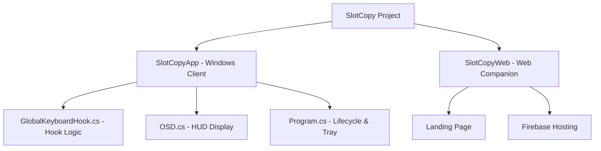

#  SlotCopy

**A high-performance, slot-based clipboard manager for Windows engineered for zero-latency productivity and muscle memory.**

SlotCopy reimagines clipboard management by moving away from the "History Model" to a "Slot Model," leveraging human spatial memory to eliminate the need for visual searching.

---

## 🌐 Live Website & Downloads
SlotCopy is officially available for download via our landing page:
### 👉 [**Download SlotCopy at slotcopyapp.web.app**](https://slotcopyapp.web.app/)

The website provides a clean interface to explore features, view documentation, and get the latest stable build.

> [!IMPORTANT]
> **Windows SmartScreen Note:** Since SlotCopy is not yet digitally signed, you may see a "Windows protected your PC" blue screen. To proceed, simply click **"More info"** and then **"Run anyway"**.
---

## 💡 The Philosophy: Human Spatial Memory
Standard clipboard managers (including Windows' `Win+V`) rely on a shifting list. Every time you copy, items move, forcing you to visually scan for what you need. This breaks your **Flow State**.

**SlotCopy** implements the **Slot Model**. By binding snippets to dedicated hardware keys (1-9), we leverage your brain's spatial memory. 
- **No Visual Searching:** Your database connection string is always Slot 1. You don't look for it; your fingers just know.
- **Zero Context Switching:** Copy 5 different things from a browser, switch to your IDE *once*, and paste them in sequence.

---

## 📖 User Guide

### 1. Installation & Setup
1. Download the latest release from [slotcopyapp.web.app](https://slotcopyapp.web.app/).
2. Run `SlotCopyApp.exe`.
3. **If a blue "Windows protected your PC" screen appears:** Click **"More info"** then **"Run anyway"**.
4. Upon first run, a **Welcome Screen** will guide you through the basic shortcuts.
5. The application lives in your **System Tray** (near the clock).

### 2. Core Interaction Model
SlotCopy uses timing-based hotkeys to stay out of your way until you need it.

| Action | Shortcut | Details |
| :--- | :--- | :--- |
| **Save to Slot** | `Ctrl + C` then `1-9` | Press `Ctrl+C` and within 500ms, tap a number key. |
| **Paste from Slot** | `Hold Ctrl + V` then `1-9` | Hold `Ctrl+V` for >150ms, then tap the slot number. |
| **Standard Paste** | `Ctrl + V` (Tap) | Tapping `Ctrl+V` works normally without triggering slots. |

### 3. Managing Slots
- **View All Slots:** Right-click the tray icon and select **"Slots Texts"**. This opens a window showing all saved snippets.
- **Auto-Start:** Right-click the tray icon and toggle **"Start with Windows"** to ensure SlotCopy is always ready.

---

## 🛠️ Technical Implementation

SlotCopy is built with a focus on low-latency and system-wide integration using the .NET framework and Win32 APIs.

### 1. Low-Level Keyboard Hooking
The core engine uses `SetWindowsHookEx` with the `WH_KEYBOARD_LL` (Low-Level Keyboard Hook) procedure. This allows SlotCopy to intercept keystrokes before they reach the active application.
- **Timing Engine:** Uses a high-precision `Stopwatch` to differentiate between a standard `Ctrl+V` tap and a "Hold" gesture.
- **Event Suppression:** When a SlotCopy trigger is detected, the event is consumed (returns `(IntPtr)1`), preventing the character from being typed into the active window.

### 2. The "Snapshot" Paste Pattern
To ensure compatibility with every Windows application, SlotCopy uses a non-destructive clipboard swap:
1. **Save Current:** The current system clipboard content is cached in memory.
2. **Inject Slot:** The system clipboard is replaced with the content from the selected slot.
3. **Simulate Input:** A hardware-level `Ctrl+V` event is simulated using `keybd_event`.
4. **Restore:** After a small delay (75ms to ensure the target app has processed the paste), the original clipboard content is restored.

### 3. Thread Safety & STA Model
The Windows Clipboard API is strictly Single-Threaded Apartment (STA). SlotCopy manages this by:
- Spawning dedicated STA background threads for all clipboard operations.
- Using `SemaphoreSlim` to prevent race conditions when multiple slots are accessed rapidly.

### 4. Persistence Layer
Slots are persisted to the local disk using high-speed JSON serialization.
- **Location:** `%AppData%\SlotCopyApp\slots.json`
- **Mechanism:** Automatic save on capture and lazy loading on application startup.

---

## 🏗️ Project Structure

- **SlotCopyApp:** The main C# Windows Forms application handling hooks and logic.
- **SlotCopyWeb:** A sleek landing page built for distribution and user onboarding.
- **Assets:** Contains the design tokens, logos, and high-quality mockups used across the project.

---
**License:** Owned by Durgesh Mahajan and can be used for personal and commercial purposes. See `LICENSE` for more information.

## 📥 Development Setup
If you wish to build SlotCopy from source:
1. Clone the repository: `git clone https://github.com/DDurgeshmahajan/Slot-Copy-App.git`
2. Open `slotcopyproject.sln` in Visual Studio 2022.
3. Ensure you have the **.NET Desktop Development** workload installed.
4. Build and run in `Release` mode for optimal performance.

---

---

  Built with ❤️ by <a href="https://github.com/DDurgeshmahajan">Durgesh Mahajan</a>

