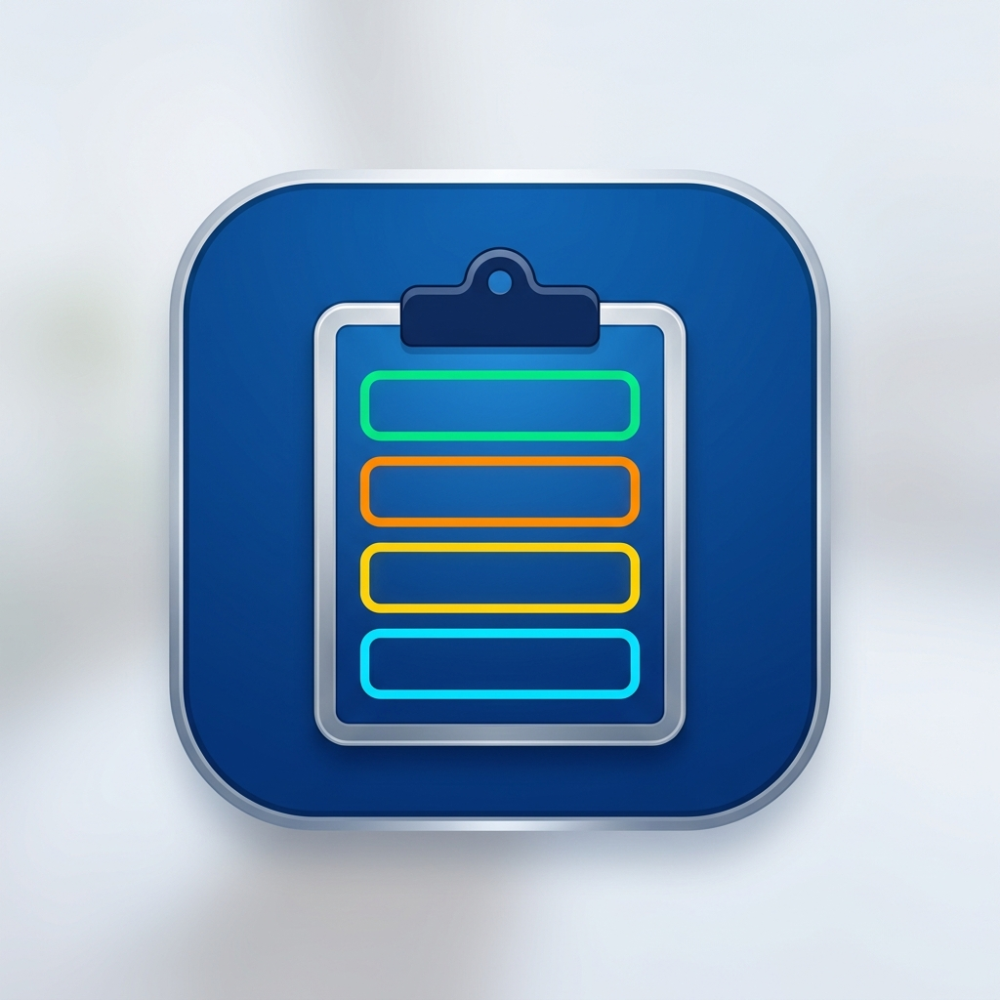
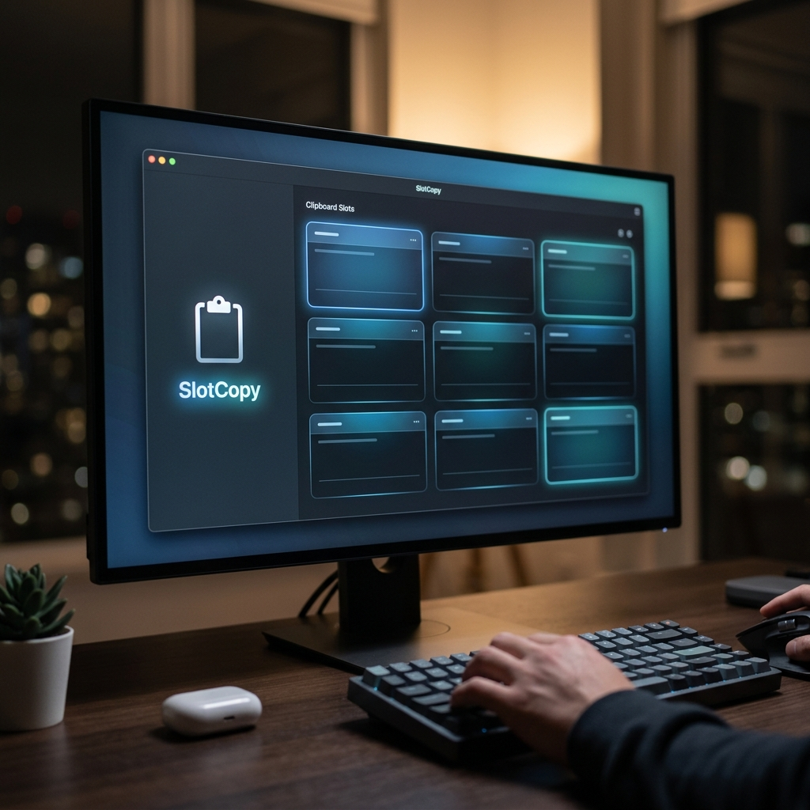

#  SlotCopy

**A high-performance, slot-based clipboard manager for Windows engineered for zero-latency productivity and muscle memory.**

---

## 🌐 Our Website is Live!
We are excited to announce that SlotCopy is now officially available for download via our landing page:
### 👉 [**Download SlotCopy at slotcopyapp.web.app**](https://slotcopyapp.web.app/)

The website provides a clean interface to explore features, view documentation, and get the latest stable build of the application.

---

## 💡 The Philosophy: Human Spatial Memory
Standard clipboard managers (including Windows' `Win+V`) rely on the **History Model**. Every time you copy, items shift down a list, forcing you to visually scan and search for what you need. This breaks your **Flow State**.

**SlotCopy** implements the **Slot Model**. By binding snippets to dedicated hardware keys (1-9), we leverage your brain's spatial memory. 
- **No Visual Searching:** Your database connection string is always Slot 1. You don't look for it; your fingers just know.
- **Zero Context Switching:** Copy 5 different things from a browser, switch to your IDE *once*, and paste them in sequence.

---

## 🚀 Key Features
- **⚡ Kernel-Level Speed:** Built using low-level Win32 hooks for near-zero latency.
- **🎯 Invisible UX:** Operates in the background with a minimalist On-Screen Display (OSD) for feedback.
- **🛡️ Clipboard Preservation:** Your standard `Ctrl+C` / `Ctrl+V` workflow remains untouched.
- **💾 Persistence:** Slots are automatically saved and restored across system restarts.
- **🧩 Web Companion:** Check out the live demo and downloads at our [Web Portal](https://slotcopyapp.web.app/).

---

## 🛠️ How to Use

### 1. Saving to a Slot
1. Highlight text and press `Ctrl + C`.
2. Within **500ms**, tap a number key (**1-9**).
3. *Done!* The snippet is now bound to that slot.

### 2. Pasting from a Slot
1. **Hold** the `V` key.
2. Tap the slot number (**1-9**).
3. *Instant Paste.*

### 3. Standard Pasting
- Just tap `V` quickly (under 250ms) or use `Ctrl + V` as usual. SlotCopy intelligently distinguishes between a "Hold" and a "Tap".

---

## 🏗️ Technical Architecture
SlotCopy is engineered at the intersection of Kernel events and User-mode logic:

- **Low-Level Hooks (`WH_KEYBOARD_LL`):** Pre-emptively intercepts keystrokes at the OS level to manage timing-based logic gates.
- **STA Thread Marshalling:** Manages the volatile Windows Clipboard via a dedicated Single Threaded Apartment (STA) background thread to ensure thread safety and prevent UI hangs.
- **State Machine Logic:** Uses high-precision `Stopwatch` intervals to distinguish between standard OS commands and SlotCopy triggers.
- **Snapshot Pattern:** Pastes data by temporarily swapping the clipboard content and restoring it in <75ms, preserving your actual clipboard history.

---

## 📥 Getting Started
1. Visit [slotcopyapp.web.app](https://slotcopyapp.web.app/).
2. Download the latest installer.
3. Run `SlotCopy.exe`.
4. Check your System Tray for the icon.

---

## 🤝 Contributing
Contributions are welcome! If you're a .NET developer interested in low-level Windows APIs, feel free to open a PR or an issue.

**License:** Distributed under the MIT License. See `LICENSE` for more information.

---

  Built with ❤️ for power users.

